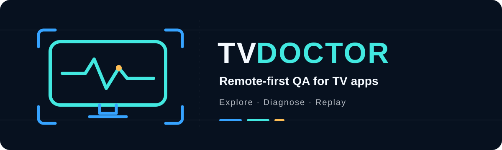

# TVDoctor

<p align="center">
  <a href="https://github.com/Ticklect/tvdoctor/actions/workflows/ci.yml"></a>
  <a href="LICENSE"></a>
  <a href="package.json"></a>
  <a href="package.json"></a>
  <a href="RELEASE.md"></a>
</p>

TVDoctor explores TV interfaces with the same small remote vocabulary people use—
Up, Down, Left, Right, Select, and Back—then produces evidence-linked findings and
deterministic replays that developers can act on.

It runs locally: no AI service, cloud account, API key, or telemetry service is
required.

> **Release candidate:** source and publishable packages are versioned `0.1.0`,
> but npm publication has not happened. Acceptance requires clean local and hosted
> gates at the exact candidate SHA; earlier green runs are supporting
> evidence, not proof of a changed candidate. All surfaces remain Beta,
> Experimental, or Planned, and repository visibility remains an explicit owner
> decision.

## Why TVDoctor

| Remote-realistic exploration | Fail-closed results | Evidence and replay |
| --- | --- | --- |
| Drives Up, Down, Left, Right, Select, and Back through bounded journeys instead of assuming pointer access. | Treats missing observability, exhausted budgets, and inconclusive replay as non-clean outcomes. | Links findings to screenshots, UI state, transitions, logs, and portable deterministic replays when Replay V1 can express them. |

## What it catches

- **Navigation:** unreachable or lost focus, focus traps, broken Back behaviour,
  and pointer-only controls.
- **Streaming and UI semantics:** playback, search, settings, accessibility, and
  layout problems where the selected driver can observe them.
- **Diagnostics:** performance, console-error, and crash signals with explicit
  evidence availability and run-status boundaries.
- **Regression baselines:** changes in issues, screens, focus targets,
  transitions, and latency through a versioned, fail-closed library.

## See it work

The Northstar fixture contains deliberate defects. The controlled streaming gate
discovers this route semantically:

```text
Home -> Details -> Play -> Controls -> Settings -> Captions -> Appearance
                                                                |
                                                                v
                                                        Text Colour visible
                                                        but no D-pad path

TVDoctor  HIGH  remote.reachability
           |- before/after screenshots
           |- UI and navigation evidence
           |- report.html / report.json
           `- portable focus-transition replay
```

The fixture gate completes 17 stages and reports four in-scope seeded defects.
That is deterministic fixture evidence, not a general accuracy claim.

**[See the full demo and exact reproduction guide →](docs/demo.md)**

## Try the source candidate

With repository access, use the declared Node.js 24 and npm 11 environment. The
lockfile is the dependency authority.

1. Clone and prepare a clean checkout:

   ```sh
   git clone https://github.com/Ticklect/tvdoctor.git
   cd tvdoctor
   npm ci
   npm run build
   npm run tvdoctor -- setup
   npm run tvdoctor -- doctor
   ```

   On Linux CI, Playwright may need system dependencies:

   ```sh
   npx playwright install chromium --with-deps
   ```

2. In terminal 1, start the deliberately broken Northstar target:

   ```sh
   npm run fixture:dev
   ```

3. In terminal 2, run the first local fixture audit:

   ```sh
   npm run tvdoctor -- test http://127.0.0.1:5173 \
     --pack navigation \
     --pack streaming \
     --mode standard \
     --output tvdoctor-report \
     --query N
   ```

Use Arrow keys, Enter, and Escape in the fixture. Northstar is a benchmark, not
a reference TV interface.

For the guided website and experimental Android TV flow, run this in an
interactive terminal:

```sh
npm run tvdoctor -- start
```

`start` asks before changing a consent or setup screen, writes normal bundles
under `Tests\`, and offers to open the report. Android scans stop the tested app
afterward but never shut down an emulator unless you explicitly ask for that in a
separate workflow; the APK is intentionally retained. TVDoctor installs its
checksum-validated observer APK; first use requires explicit accessibility
enablement on the Android device. For prompt-free automation, use:

```powershell
tvdoctor test --apk D:\apps\example.apk --device emulator-5554 --mode quick
```

## Choose a surface

| Surface | Support / maturity | Start here |
| --- | --- | --- |
| [Web audit](docs/drivers/web.md) | Experimental | Playwright Chromium with bounded production evidence; DOM semantics are not the browser accessibility tree. |
| [Android TV](docs/drivers/android.md) | Experimental | API 36 emulator evidence only; no physical-device or vendor compatibility claim. |
| [Reports](#report-bundle) | Beta format | `tvdoctor.report/v1` is the canonical result, with human-readable HTML and Markdown views. |
| [Replay](#replay) | Beta format, bounded execution | `tvdoctor.replay/v1` executes supported deterministic focus transitions; other findings remain review-only. |
| [Baselines](docs/baselines-and-ci.md) | Experimental | Versioned, fail-closed CLI and library comparison with semantic inventories. |
| [Limitations](docs/limitations.md) | Required reading | Current observability, evidence, platform, and compatibility boundaries. |

### Registry installation

These commands are the intended npm experience after publication; they are not
an assertion that `tvdoctor@0.1.0` is currently available from the registry:

```sh
npm install --save-dev tvdoctor
npx tvdoctor setup
npx tvdoctor test http://127.0.0.1:3000
```

Until publication is verified, use the source-checkout commands above.

## CLI reference

```text
tvdoctor test URL [--pack NAME] [--mode MODE] [--output PATH] [--query TEXT]
tvdoctor test URL [--startup-actions KEY[,KEY...]] [--max-duration-ms N]
tvdoctor test URL --journey PATH
tvdoctor accessibility URL [--mode quick|deep] [--output PATH] [--journey PATH]
tvdoctor setup
tvdoctor doctor
tvdoctor replay ISSUE_ID [--report PATH] [--target URL]
tvdoctor version
tvdoctor --help
```

`test` accepts one absolute HTTP(S) URL without embedded credentials:

| Option | Values and behaviour |
| --- | --- |
| `--pack NAME` | `navigation`, `streaming`, `search`, `settings`, `accessibility`, `layout`, `performance`, or `crashes`. Repeat to select several. Omit it (or use `all` alone) to run every pack. |
| `--mode MODE` | `quick` or `deep`; the advanced `standard` alias remains accepted for existing scripts. Modes select predefined bounded action/state/depth/time profiles; the report records the effective combined budgets. |
| `--output PATH` | New report-bundle directory. Omit it to create a readable collision-safe bundle under `Tests\`. Choose a trusted, writable, non-existing path and do not reuse a bundle directory. |
| `--query TEXT` | Printable, non-sensitive search text, at most 64 characters. Defaults to `N`. It may be entered into the target and retained as evidence. |
| `--startup-actions KEY[,KEY...]` | Explicit caller-selected remote keys used only after TVDoctor detects a focused setup wall. Observation-only is the default; TVDoctor never chooses consent. |
| `--journey PATH` | Run a bounded JSON preparation journey before the audit. Sensitive text can only come from `TVDOCTOR_JOURNEY_*` environment variables. See [Custom web journeys](docs/custom-web-journeys.md). |
| `--max-duration-ms N` | Advanced navigation safety-ceiling override for CI or exhaustive runs. |

`setup` installs the exact Chromium build required by TVDoctor and verifies that
it launches. `doctor` checks the declared Node runtime, host, installed Chromium,
and whether the audit host is available. Run it before a long audit.

`version`, `--version`, and `-V` print the installed CLI package version.

`accessibility` is the focused web profile. It runs the streaming and
accessibility packs together so one report covers semantic labels, hidden
focusable controls, focus visibility, and reachable caption controls. Browser
evidence does not prove TalkBack, text scaling, audio-description preferences,
autoplay behavior, or physical-TV rendering.

If the original audit used a custom journey, replay requires the same
`--journey PATH`. TVDoctor verifies its SHA-256 fingerprint before constructing
a browser driver so a different preparation path cannot weaken replay
correlation.

### Exit codes

| Code | Meaning |
| ---: | --- |
| `0` | Command completed successfully: an audit found no issues, replay classified the issue fixed, or doctor/help/version succeeded. |
| `1` | The audit completed and found one or more issues; replay reproduced an issue; or doctor found an unavailable requirement. |
| `2` | Invalid command, option, URL, identifier, or other usage. |
| `3` | Partial audit or inconclusive replay. The result is not clean. |
| `4` | Execution failed before a trustworthy result was produced. |

CI must fail on every non-zero code unless a workflow is deliberately collecting
a known seeded-fixture result. In particular, never translate code 3 into pass.

## Complete, partial, and failed runs

A complete audit exhausted no required coverage boundary. It can still exit 1
because confirmed findings are the product output.

A partial audit records which pack or stage could not complete and exits 3.
Common causes include a safety ceiling with queued work, target disappearance,
missing capabilities, unstable reset/replay, interrupted evidence capture, or an
unresolved startup setup blocker. A safety-ceiling result is bounded-incomplete,
not an engine crash; its ledger records the remaining frontier and candidate
actions. Open the bundle, read **Run status**, **Pack coverage**, and
unavailable-evidence reasons, address the stated cause when applicable, and rerun
into a new output directory. A partial run with zero findings does not show that
the target is clean.

Exit 4 means no trustworthy command result was produced. A partial bundle may
still exist after a late failure; treat it as diagnostic material only.

## Report bundle

```text
tvdoctor-report/
|- report.html       start here: interactive human report
|- report.json       canonical tvdoctor.report/v1 data for CI and replay
|- exports/
|  |- portable-summary.md  portable text summary
|  `- agent-fix-tasks.md   evidence-linked coding-agent tasks
|- stage-ledger.json internal stage/recovery record
|- inventory.json    semantic baseline inventory
|- evidence/         screenshots, UI excerpts, transitions, and logs
`- replays/          available tvdoctor.replay/v1 documents
```

Start with `report.html`. It leads with a plain verdict and the findings that need
attention. Problem, expected and observed behaviour, exact steps, screenshots,
and replay are shown first; run metadata, budgets, hashes, and raw evidence stay
available in collapsed technical sections. `report.json` is the canonical
machine-readable result. Files under `exports/` are derived views for sharing and
coding tools, not additional sources of truth.

Open the static HTML locally:

```sh
# macOS
open tvdoctor-report/report.html

# Linux
xdg-open tvdoctor-report/report.html

# Windows PowerShell
Start-Process .\tvdoctor-report\report.html
```

Unavailable evidence is represented explicitly. Report generation escapes
target-controlled content and redacts common credential shapes, but screenshots,
UI text, logs, URLs, and search input can still contain sensitive information.
Review the entire bundle before sharing or uploading it.

## Replay

With the target running, copy a deterministic issue ID from the report:

```sh
npm run tvdoctor -- replay ISSUE_ID \
  --report tvdoctor-report/report.json \
  --target http://127.0.0.1:5173
```

Replay V1 resets the target, executes the stored setup path, checks the focus
precondition, sends the final remote action, and compares the observed transition.
It does not rerun the audit and it does not prove root cause.

Only deterministic focus-transition findings with an available, correlated V1
replay are executable. Numeric playback state, selection, focus styling,
geometry, clipping, latency, log, crash, and screenshot findings remain
review-only when V1 cannot express their corrected state.

Reports strip credentials and may strip an original URL's query or fragment. If
the audited route depended on a query string or hash, replay must not guess it:
pass the exact authorised route again with `--target`. Never put passwords,
tokens, session IDs, or personal data in that URL.

## Regression baselines

Create a baseline from a reviewed, complete report, then compare later runs:

```sh
tvdoctor baseline create --report tvdoctor-report/report.json --output tvdoctor-baseline.json
tvdoctor baseline compare --baseline tvdoctor-baseline.json --report current-report/report.json
```

The comparison prints counts such as `2 new, 1 resolved, 4 unchanged findings`
and writes `baseline-comparison.json`. Missing coverage, partial runs, target
mismatches, or invalid inputs fail closed rather than producing a clean result.

## CI and release checks

Use the bundled GitHub Action after starting your application in the workflow:

```yaml
- name: Audit the TV interface
  uses: Ticklect/tvdoctor@v0.1.0
  with:
    target: http://127.0.0.1:3000
    mode: quick
    fail-on: high
```

The action uploads the complete report, adds a concise job summary, exposes the
JUnit path, and fails on findings at or above the chosen threshold. Partial and
failed audits always remain non-successful. The equivalent local command is:

```sh
tvdoctor ci http://127.0.0.1:3000 --mode quick --fail-on high
```

The repository workflow uses Node 24, installs Playwright Chromium, runs build,
lint, typecheck, unit and real-browser integration gates, executes the exact CLI
M7 integration, performs clean tarball/consumer smoke testing, and uploads useful
failure artifacts. It uses no repository secrets.

Run the same release-relevant checks locally:

```sh
npm ci
npm run build
npm run tvdoctor -- setup
npm run check
npm run test:package-smoke
node examples/baseline-ci-example.mjs
```

Generated artifacts are ignored by Git. The [release procedure](RELEASE.md)
requires a clean worktree and a hosted run at the exact candidate commit; an
older green run is supporting evidence, not proof of a changed candidate.

## Troubleshooting

- **Chromium executable is missing:** run `npx tvdoctor setup`; on
  Linux CI use `--with-deps`, then rerun `tvdoctor doctor`.
- **Unsupported Node/npm:** install a Node 24/npm 11 environment and rerun
  `npm ci`. Do not use `--force` to bypass the declared engine range.
- **Target cannot be reached:** open the URL in Chromium from the same host,
  confirm the local server is still running, and avoid production/authenticated
  targets.
- **Output directory already exists or is unwritable:** choose a new directory
  under a trusted writable location. TVDoctor does not merge report bundles.
- **Audit seems slow:** packs intentionally reset and replay paths; dynamic pages
  can consume the bounded settle and duration budgets. Use `quick` for an initial
  probe, then inspect partial reasons before increasing scope.
- **Replay is inconclusive:** confirm the target version and route match the
  report, supply `--target` when query/hash routing was redacted, and check the
  issue has an available deterministic replay.
- **Interrupted run:** confirm the target and browser processes stopped, retain
  any partial bundle for diagnosis, and rerun into a fresh directory.

## Compatibility and support

Status words are deliberate:

- **Stable** promises maintained production compatibility. Nothing is Stable in
  the v0.1 preview.
- **Beta** has repeatable controlled evidence, but can still change before 1.0.
- **Experimental** is useful for bounded evaluation with intentionally narrow
  support and evidence.
- **Planned** is not implemented or supported.

| Surface | Status | Evidence and boundary |
| --- | --- | --- |
| Node.js 24 + npm 11 source workspace | Beta | Clean local and hosted Linux installs have passed; other major versions are outside the declared engine range. |
| `tvdoctor.report/v1` and `tvdoctor.replay/v1` | Beta | Strict parsing, cross-link, redaction, rendering, and real-browser replay tests. Formats remain pre-1.0. |
| Deterministic core and streaming pack | Beta | Unit and controlled real-Chromium fixture gates; no arbitrary-app accuracy claim. |
| Playwright Chromium web driver | Experimental | Real Chromium and bounded production probes; DOM semantic tree is not the browser accessibility tree. |
| `tvdoctor test URL` audit host | Experimental | Complete controlled M7 fixture gate and bounded production stress evidence; broader framework/browser evidence is still limited. |
| Android TV persistent-observer driver | Experimental | Versioned framed local protocol, event-driven accessibility state, real API 36 emulator Quick/Deep/replay/cancellation gates; no physical-device/vendor compatibility claim. |
| Baseline comparison library | Experimental | Versioned fail-closed library, controlled lifecycle proof, hosted example; not yet a standalone CLI workflow. |
| Linux hosted verification | Beta evidence | Earlier exact candidates passed on `ubuntu-latest`; every changed release candidate needs a new exact-SHA run. |
| Windows development verification | Experimental evidence | Local release work has run on Windows; no hosted Windows matrix is claimed. |
| macOS release verification | Planned | No hosted matrix is claimed. |
| [Physical Android/Google/Fire TV devices](docs/physical-device-proof.md) | Proof runner ready; hardware evidence pending | Emulator evidence never implies physical-device support. |
| Fire TV, Roku, Tizen, and webOS | Planned | No adapters or compatibility commitments. |

Read [current limitations](docs/limitations.md), the
[architecture guide](docs/architecture.md), and [baselines and CI](docs/baselines-and-ci.md)
before relying on a result.

## Documentation

- [Demo and exact reproduction](docs/demo.md)
- [Examples](docs/examples.md)
- [Fixtures and benchmark controls](docs/fixtures.md)
- [Web driver](docs/drivers/web.md)
- [Android driver](docs/drivers/android.md)
- [Writing a driver](docs/drivers/authoring.md)
- [Baselines and CI](docs/baselines-and-ci.md)
- [Architecture](docs/architecture.md)
- [Limitations](docs/limitations.md)
- [Roadmap](docs/roadmap.md)
- [Release procedure](RELEASE.md)
- [Changelog](CHANGELOG.md)
- [Contributing](CONTRIBUTING.md)
- [Security policy](SECURITY.md)

## Contributing, security, and licence

Bug reports, fixtures, diagnostics, and carefully scoped driver work are welcome.
Read [CONTRIBUTING.md](CONTRIBUTING.md). Do not put secrets, proprietary target
data, or unredacted report bundles in an issue.

Report suspected vulnerabilities through GitHub's private vulnerability-reporting
flow described in [SECURITY.md](SECURITY.md). TVDoctor source code is available under the [GNU Affero General Public License v3.0 only](LICENSE).
See [LICENSING.md](LICENSING.md) for commercial-licensing information and
[TRADEMARKS.md](TRADEMARKS.md) for use of the TVDoctor name and logo.
